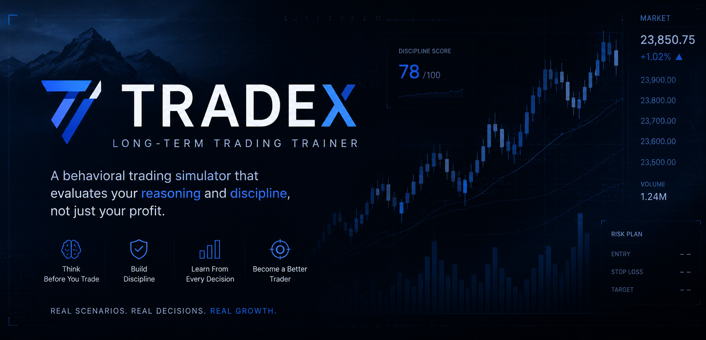

<p align="center">
  
</p>

<p align="center">
  <strong>A behavioral trading simulator that evaluates your reasoning and discipline, not just your profit.</strong>
</p>

---

## ✦ The Idea

Most trading simulators ask one question:

> **Did you make money?**

TRADEX looks deeper.

# TRADEX

> **A long-term trading trainer built around one question:**
> *Can you make good decisions when the market makes it difficult?*

TRADEX is a behavioral trading simulator that evaluates **how you trade**, not just how much you make.

---

## ✦ The Idea

Most trading simulators reward one thing:

> **Did you make money?**

TRADEX looks deeper.

Before entering a trade, you're required to explain **why** you're taking it. As the market develops, the simulator evaluates your decisions for behavioral patterns such as:

- FOMO entries
- Panic exits
- Impatience
- Poor risk planning
- Inconsistent reasoning
- Emotion-driven decisions

Your final result isn't just a P&L number.

It's a picture of your **decision-making discipline**.

---

## Features

| Feature | Status |
|---|:---:|
| 5 long-term market scenarios | ✅ |
| Support bounce & FOMO trap patterns | ✅ |
| Slow bleed & reversal patterns | ✅ |
| Accumulation scenarios | ✅ |
| Pre-trade reasoning required | ✅ |
| Behavioral mistake detection | ✅ |
| Inconsistency detection | ✅ |
| Local AI trading coach | ✅ |
| 3M / 6M / 1Y timeframes | ✅ |
| Live P&L tracking | ✅ |
| Reference trade library | ✅ |
| Animated dark-mode interface | ✅ |

---

## 🧠 Behavioral Training

TRADEX doesn't simply tell you whether a trade was profitable.

It compares your **reasoning with your actions**.

For example:

```text
Reasoning:
"Entering near support with an 8% stop loss."

        ↓

Market moves against you

        ↓

You exit after a small drawdown

        ↓

TRADEX detects:
• Early exit
• Inconsistent risk plan
• Loss aversion

        ↓

Discipline score + coaching
```

A profitable trade can still be a **bad decision**.

A losing trade can still be a **good decision**.

That's the core philosophy behind TRADEX.

---

## 🤖 Local AI Coaching

TRADEX uses **Ollama** to provide personalized trading feedback through a locally running LLM.

The AI coach analyzes your decisions and reasoning to help identify:

- Behavioral patterns
- Contradictions between plans and actions
- Risk-management issues
- Repeated mistakes
- Areas for improvement

No hosted AI API is required.

---

## 🛠️ Tech Stack

| Layer | Technology |
|---|---|
| Frontend | React |
| Charts | Chart.js |
| Backend | Node.js + Express |
| Real-time communication | Socket.IO |
| AI | Ollama |
| Models | Llama / Mistral |
| UI | Custom dark-mode interface |

---

## 🚀 Getting Started

### Prerequisites

- Node.js **v18+**
- [Ollama](https://ollama.com) installed and running
- A local Ollama model

Pull a model before starting:

```bash
ollama pull llama3
```

Or:

```bash
ollama pull mistral
```

### 1. Start the Backend

```bash
cd backend
npm install
node server.js
```

The backend runs on:

```text
http://localhost:5000
```

### 2. Start the Frontend

Open another terminal:

```bash
cd frontend
npm install
npm start
```

The frontend runs on:

```text
http://localhost:3000
```

---

## 📁 Project Structure

```text
TRADEX/
│
├── backend/
│   ├── server.js        # Express + Socket.IO + Ollama proxy
│   └── package.json
│
├── frontend/
│   ├── public/
│   │   └── index.html
│   │
│   └── src/
│       ├── App.js       # Main application
│       ├── data.js      # Scenarios + reference trades
│       ├── index.css    # Design system + animations
│       └── index.js     # React entry point
│
└── README.md
```

---

## 🎮 How to Demo

### 1. Start the application

Open:

```text
http://localhost:3000
```

### 2. Explore the reference trades

Compare examples of **good vs. poor trading decisions**.

### 3. Select a scenario

Try:

> **FOMO Spike Trap**

### 4. Explain your entry

For example:

> *"Pullback to support, RSI oversold, stop loss at -8%."*

### 5. Enter the trade

Hold through the market's volatility and make decisions as the scenario develops.

### 6. Exit

TRADEX evaluates your decision-making and generates:

- Discipline score
- Behavioral observations
- AI coaching

### 7. Try again

Make different decisions and compare how your reasoning affects your score.

---

## 🎯 Problem Statement

> Retail traders can struggle not because they lack strategies, but because decision-making becomes difficult under uncertainty.

FOMO, loss aversion, impatience, and inconsistent risk management can turn a reasonable strategy into a poor trade.

TRADEX focuses on the part most simulators overlook:

**the behavior behind the trade.**

---

## 👥 Target Audience

TRADEX is designed for:

- **Beginner–intermediate retail traders**  
  0–3 years of experience

- **Finance students**  
  Learning applied trading psychology

- **Trading educators**  
  Demonstrating behavioral patterns

- **Prop training programs**  
  Evaluating decision-making and discipline

---

## 🔮 Future Scope

Potential directions for TRADEX include:

- Multiplayer discipline challenges
- Personal trade history
- Long-term discipline tracking
- Progress dashboards
- Cloud deployment
- More market scenarios
- Indian-market scenarios based on Nifty and Sensex
- Mobile application

---

## ✦ What TRADEX Measures

TRADEX isn't trying to answer:

> **"Did you make money?"**

It's trying to answer:

> **"Did you make a decision you could defend?"**

Because in trading, **one lucky trade doesn't make a disciplined trader.**

---

<p align="center">

**Built for traders who want to get better — not just get lucky.**

</p>
